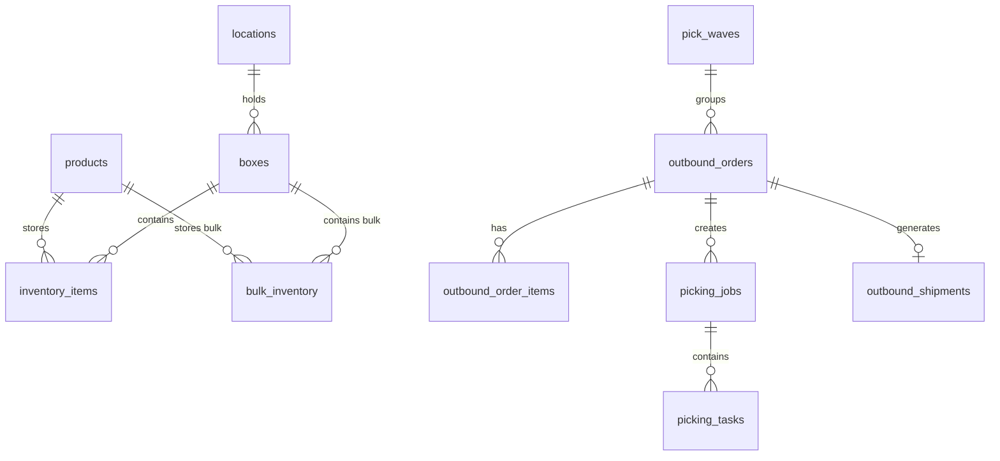

# WMS System - OPUS Audit Documentation

> **Generated:** 2026-02-05  
> **Purpose:** Comprehensive system documentation organized by module

---

## System Overview

Hệ thống WMS (Warehouse Management System) được thiết kế để quản lý toàn bộ hoạt động kho hàng, bao gồm:
- **Nhập kho** (Inbound): Tiếp nhận hàng hóa từ nhà cung cấp
- **Lưu trữ** (Inventory): Quản lý vị trí và số lượng tồn kho
- **Đơn hàng xuất** (Outbound): Xử lý đơn bán hàng và điều chuyển
- **Xuất kho** (Shipping): Đóng gói và giao hàng

---

## Core Data Model



---

## Module Index

| # | Module | Description | Document |
|---|--------|-------------|----------|
| 1 | **Inbound** | Nhập kho Lẻ & Sỉ | [01_INBOUND.md](./01_INBOUND.md) |
| 2 | **Inventory** | Quản lý tồn kho | [02_INVENTORY.md](./02_INVENTORY.md) |
| 3 | **Outbound Orders** | Tạo & duyệt đơn | [03_OUTBOUND_ORDERS.md](./03_OUTBOUND_ORDERS.md) |
| 4 | **Picking & Packing** | Nhặt & đóng gói | [04_PICKING_PACKING.md](./04_PICKING_PACKING.md) |
| 5 | **Shipping** | Xuất kho & PXK | [05_SHIPPING.md](./05_SHIPPING.md) |
| 6 | **Wave Management** | Quản lý Wave | [06_WAVE_MANAGEMENT.md](./06_WAVE_MANAGEMENT.md) |
| 7 | **Transactions** | Lịch sử giao dịch | [07_TRANSACTIONS.md](./07_TRANSACTIONS.md) |
| 8 | **Master Data** | Dữ liệu chủ | [08_MASTER_DATA.md](./08_MASTER_DATA.md) |

---

## Database Tables Summary

### Core Tables
| Table | Purpose | Key Columns |
|-------|---------|-------------|
| `products` | Danh mục sản phẩm | `id`, `sku`, `name`, `barcode` |
| `boxes` | Thùng hàng | `id`, `code`, `type`, `status`, `location_id` |
| `locations` | Vị trí kho | `id`, `code`, `zone`, `row`, `column`, `level` |
| `inventory_items` | Tồn kho lẻ | `product_id`, `box_id`, `quantity`, `allocated_quantity` |
| `bulk_inventory` | Tồn kho sỉ | `product_id`, `box_id`, `quantity`, `allocated_quantity` |

### Order Tables
| Table | Purpose | Key Columns |
|-------|---------|-------------|
| `outbound_orders` | Đơn hàng xuất | `id`, `code`, `type`, `status`, `inventory_type` |
| `outbound_order_items` | Chi tiết đơn | `order_id`, `product_id`, `quantity`, `picked_quantity` |
| `outbound_shipments` | Phiếu xuất kho | `id`, `code`, `outbound_order_id`, `box_count` |

### Picking Tables
| Table | Purpose | Key Columns |
|-------|---------|-------------|
| `picking_jobs` | Công việc nhặt hàng | `id`, `outbound_order_id`, `type`, `status` |
| `picking_tasks` | Tác vụ nhặt | `job_id`, `product_id`, `box_id`, `quantity` |
| `picking_exceptions` | Ngoại lệ nhặt hàng | `task_id`, `expected_qty`, `actual_qty` |
| `pick_waves` | Đợt nhặt hàng | `id`, `name`, `status` |

---

## Key Business Flows

### Flow 1: Kho Lẻ (Piece Inventory)
```
Nhập hàng → inventory_items → Phân bổ → Nhặt vào Outbox → Xuất kho
```

### Flow 2: Kho Sỉ (Bulk Inventory)
```
Nhập hàng → bulk_inventory → Phân bổ → Nhặt nguyên thùng → Xuất kho
```

> **CRITICAL:** Hai luồng này **TÁCH BIỆT HOÀN TOÀN**. Đơn Sỉ lấy từ `bulk_inventory`, Đơn Lẻ lấy từ `inventory_items`.

---

## RPC Functions Overview

| Category | RPC | Purpose |
|----------|-----|---------|
| **Inbound** | `process_bulk_putaway` | Nhập hàng sỉ vào kho |
| **Outbound** | `approve_outbound` | Duyệt đơn hàng |
| **Outbound** | `allocate_outbound` | Phân bổ tồn kho cho đơn |
| **Outbound** | `deallocate_outbound` | Hủy phân bổ |
| **Picking** | `confirm_picking_batch` | Xác nhận nhặt hàng lẻ |
| **Picking** | `confirm_box_pick` | Xác nhận nhặt nguyên thùng |
| **Picking** | `complete_picking_job` | Hoàn tất Job nhặt hàng |
| **Shipping** | `ship_outbound_order` | Xuất kho đơn hàng |
| **Wave** | `release_wave_v3` | Release Wave nhặt hàng |
