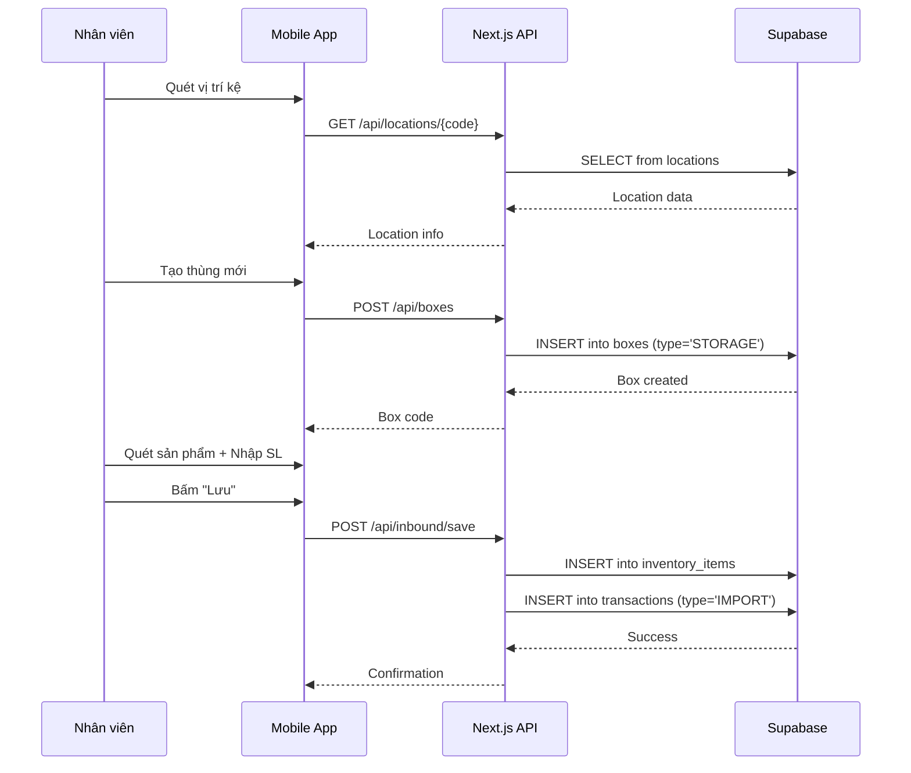
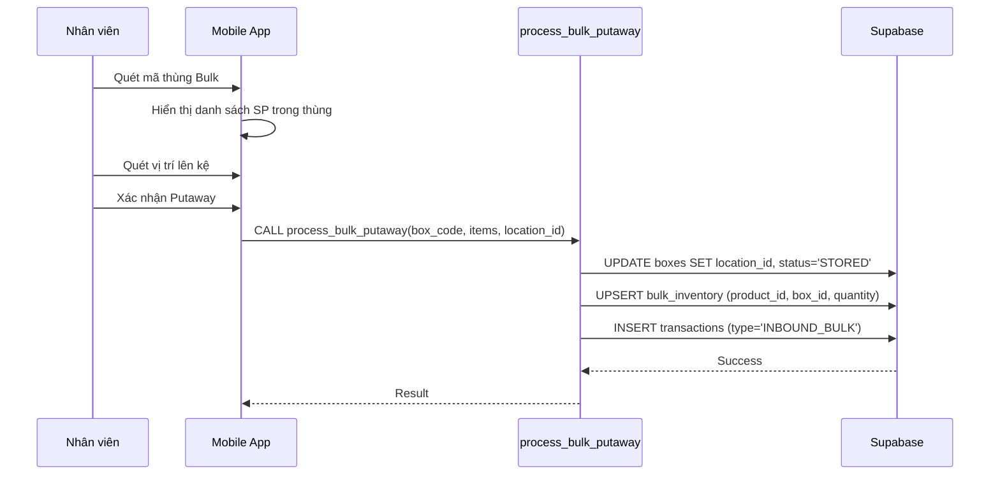

# Module 1: Inbound (Nhập Kho)

> **Last Updated:** 2026-02-05  
> **Status:** Active  
> **Owner:** Warehouse Operations

---

## 1. Overview

Module Inbound quản lý toàn bộ quy trình nhập hàng vào kho, bao gồm:
- Nhập hàng lẻ (Piece Inbound)
- Nhập hàng sỉ/nguyên kiện (Bulk Inbound)
- Lên kệ (Putaway)

---

## 2. Features

### 2.1 Nhập Hàng Lẻ (Piece Inbound)
| Feature | Description | UI Page |
|---------|-------------|---------|
| Tạo thùng mới | Tạo thùng STORAGE mới để chứa hàng lẻ | `/mobile/import` |
| Quét sản phẩm | Quét barcode để thêm sản phẩm vào thùng | `/mobile/import` |
| Nhập số lượng | Nhập số lượng cho từng sản phẩm | `/mobile/import` |
| Lưu nhập kho | Ghi nhận vào database | `/mobile/import` |

### 2.2 Nhập Hàng Sỉ (Bulk Inbound)
| Feature | Description | UI Page |
|---------|-------------|---------|
| Tạo phiếu nhập sỉ | Tạo thùng BULK với danh sách sản phẩm | `/admin/bulk/inbound` |
| Quét thùng sỉ | Quét mã thùng nguyên kiện từ nhà cung cấp | `/mobile/bulk-putaway` |
| Lên kệ sỉ | Đặt thùng sỉ vào vị trí lưu trữ | `/mobile/bulk-putaway` |

---

## 3. Data Flow

### 3.1 Luồng Nhập Hàng Lẻ



### 3.2 Luồng Nhập Hàng Sỉ (Bulk Putaway)



---

## 4. Database Impact

### 4.1 Tables Affected

| Table | Operation | Columns Modified |
|-------|-----------|------------------|
| `boxes` | INSERT/UPDATE | `id`, `code`, `type`, `status`, `location_id`, `created_at` |
| `inventory_items` | INSERT (Lẻ) | `product_id`, `box_id`, `quantity`, `created_at` |
| `bulk_inventory` | UPSERT (Sỉ) | `product_id`, `box_id`, `location_id`, `quantity`, `warehouse_id` |
| `transactions` | INSERT | `type`, `sku`, `quantity`, `from_box_id`, `reference_id` |
| `locations` | READ | (không thay đổi) |

### 4.2 Column Details

#### `boxes` Table
```sql
-- Key columns for Inbound
id UUID PRIMARY KEY
code TEXT UNIQUE          -- Mã thùng (VD: INB-0205-0001)
type TEXT                 -- 'STORAGE' | 'BULK' | 'OUTBOX'
status TEXT               -- 'OPEN' | 'STORED' | 'LOCKED' | 'SHIPPED'
location_id UUID          -- FK to locations
inventory_type TEXT       -- 'PIECE' | 'BULK'
created_at TIMESTAMP
```

#### `inventory_items` Table (Kho Lẻ)
```sql
id UUID PRIMARY KEY
product_id UUID           -- FK to products
box_id UUID               -- FK to boxes
quantity INTEGER          -- Số lượng hiện có
allocated_quantity INTEGER DEFAULT 0  -- Số lượng đã được đặt trước
created_at TIMESTAMP
```

#### `bulk_inventory` Table (Kho Sỉ)
```sql
id UUID PRIMARY KEY
product_id UUID           -- FK to products
box_id UUID               -- FK to boxes
location_id UUID          -- FK to locations (denormalized for performance)
warehouse_id UUID         -- FK to warehouses
quantity INTEGER          -- Số lượng nguyên kiện
allocated_quantity INTEGER DEFAULT 0  -- Số lượng đã phân bổ cho đơn
created_at TIMESTAMP

UNIQUE (product_id, box_id)  -- Mỗi SP chỉ có 1 record per box
```

---

## 5. RPC Functions

### 5.1 `process_bulk_putaway`

**Purpose:** Xử lý nhập hàng sỉ vào kho, bao gồm cập nhật vị trí thùng và ghi nhận tồn kho.

**Signature:**
```sql
FUNCTION process_bulk_putaway(
    p_box_code TEXT,
    p_items JSONB,
    p_location_id UUID,
    p_user_id UUID DEFAULT NULL
) RETURNS JSONB
```

**Input Parameters:**
| Param | Type | Description |
|-------|------|-------------|
| `p_box_code` | TEXT | Mã thùng Bulk (VD: "INB-0205-0883") |
| `p_items` | JSONB | Array of `{product_id, quantity}` |
| `p_location_id` | UUID | ID vị trí lên kệ |
| `p_user_id` | UUID | ID nhân viên thực hiện |

**Output:**
```json
{
  "success": true,
  "box_id": "uuid",
  "message": "Đã lên kệ thành công"
}
```

**Logic Flow:**
1. Tìm hoặc tạo Box theo `p_box_code`
2. Cập nhật `boxes.location_id` và `boxes.status = 'STORED'`
3. Với mỗi item trong `p_items`:
   - UPSERT vào `bulk_inventory` (cộng dồn nếu đã tồn tại)
   - Ghi log vào `transactions`
4. Return kết quả

**Database Operations:**
```sql
-- Step 1: Update box location
UPDATE boxes 
SET location_id = p_location_id, 
    status = 'STORED', 
    updated_at = NOW()
WHERE code = p_box_code;

-- Step 2: Upsert bulk inventory
INSERT INTO bulk_inventory (product_id, box_id, location_id, quantity)
VALUES (item.product_id, v_box_id, p_location_id, item.quantity)
ON CONFLICT (product_id, box_id) 
DO UPDATE SET 
    quantity = bulk_inventory.quantity + EXCLUDED.quantity,
    location_id = EXCLUDED.location_id;

-- Step 3: Log transaction
INSERT INTO transactions (type, entity_type, sku, quantity, from_box_id, user_id, note)
VALUES ('INBOUND_BULK', 'ITEM', v_sku, item.quantity, v_box_id, p_user_id, 'Nhập sỉ');
```

---

## 6. UI Pages

### 6.1 Admin Pages
| Page | Path | Purpose |
|------|------|---------|
| Bulk Inbound | `/admin/bulk/inbound` | Tạo phiếu nhập sỉ, xem lịch sử |
| Print Labels | `/admin/bulk-print` | In nhãn thùng sỉ |

### 6.2 Mobile Pages
| Page | Path | Purpose |
|------|------|---------|
| Import | `/mobile/import` | Nhập hàng lẻ vào thùng |
| Bulk Putaway | `/mobile/bulk-putaway` | Lên kệ thùng sỉ |

---

## 7. Transaction Types

| Type | Description | Triggered By |
|------|-------------|--------------|
| `IMPORT` | Nhập hàng lẻ | `/mobile/import` save |
| `INBOUND_BULK` | Nhập hàng sỉ | `process_bulk_putaway` RPC |

---

## 8. Known Issues & Notes

### 8.1 Constraint: Unique Product-Box
Bảng `bulk_inventory` có constraint `UNIQUE (product_id, box_id)`. Điều này có nghĩa:
- Mỗi sản phẩm chỉ có **1 record** trong mỗi thùng
- Nếu nhập thêm cùng SP vào cùng thùng → **Cộng dồn số lượng**

### 8.2 Warehouse ID
Cột `warehouse_id` trong `bulk_inventory` được tự động gán từ location's warehouse.

### 8.3 Box Type Detection
- Box có prefix `INB-` → Type = `BULK`
- Box có prefix `OUT-` → Type = `OUTBOX`
- Box không có prefix đặc biệt → Type = `STORAGE`

---

## 9. Related Modules

- **[02_INVENTORY.md](./02_INVENTORY.md)** - Sau khi nhập, hàng được quản lý trong Inventory
- **[07_TRANSACTIONS.md](./07_TRANSACTIONS.md)** - Mọi thao tác nhập đều được ghi log
