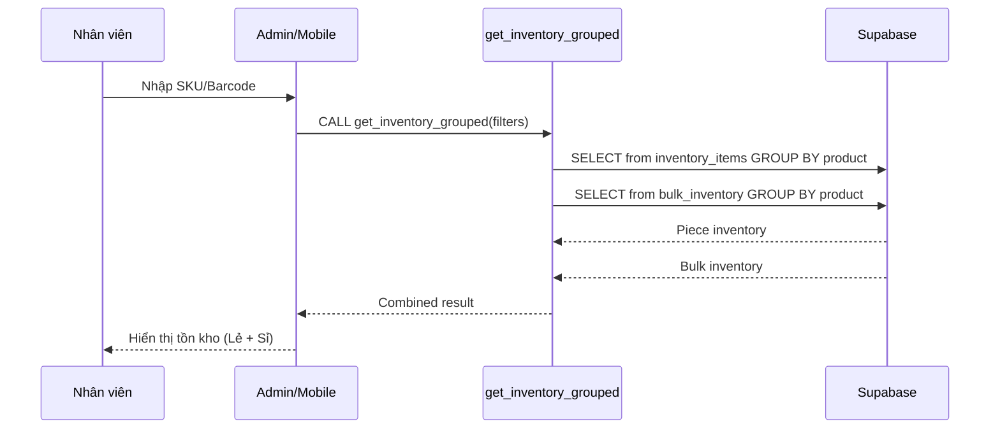
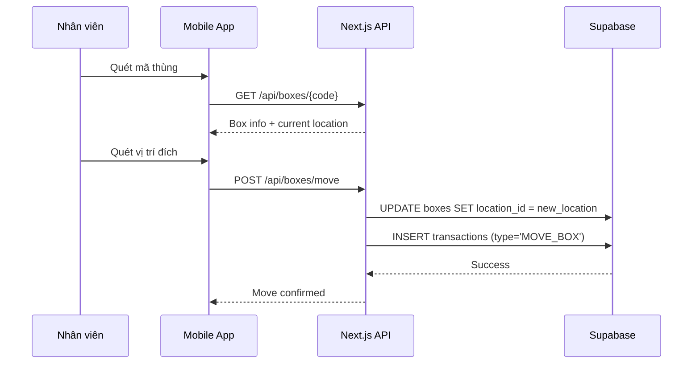
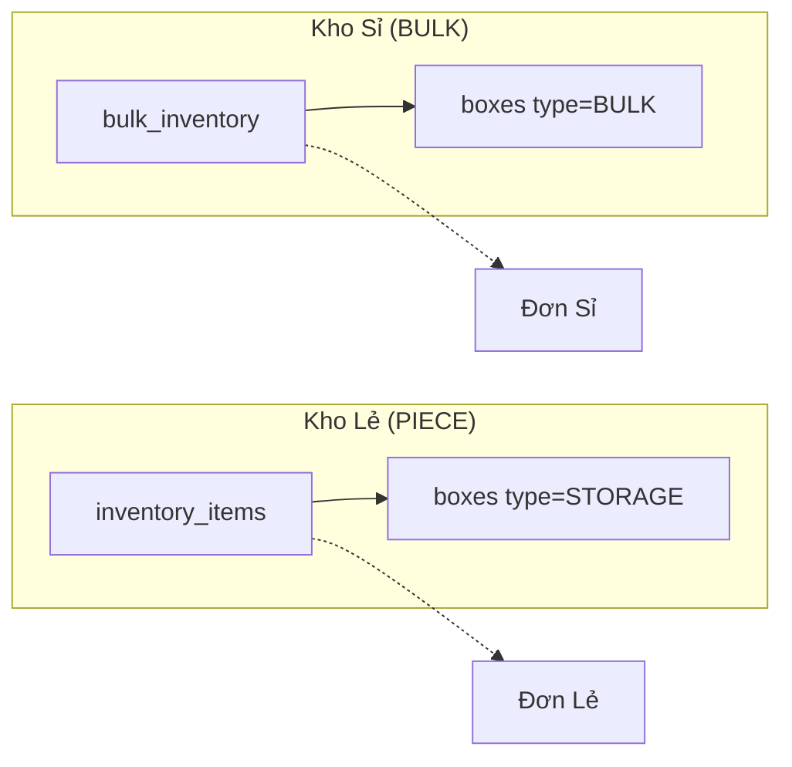

# Module 2: Inventory Management (Quản Lý Tồn Kho)

> **Last Updated:** 2026-02-05  
> **Status:** Active

---

## 1. Overview

Module Inventory quản lý toàn bộ tồn kho trong hệ thống, bao gồm:
- Tra cứu tồn kho theo SKU/Barcode
- Xem chi tiết thùng hàng
- Di chuyển thùng giữa các vị trí
- Quản lý vùng hạn chế (Restricted)

---

## 2. Features

| Feature | Description | UI Page |
|---------|-------------|---------|
| Tra cứu tồn kho | Tìm kiếm theo SKU/Barcode | `/admin/inventory`, `/mobile/lookup` |
| Xem chi tiết thùng | Xem nội dung và lịch sử thùng | `/admin/boxes/[id]`, `/mobile/box/[code]` |
| Di chuyển thùng | Chuyển thùng sang vị trí khác | `/mobile/transfer` |
| Quản lý Restricted | Xem hàng trong vùng hạn chế | `/admin/inventory/restricted` |
| Xem vị trí | Xem thùng tại vị trí cụ thể | `/mobile/locations/[id]` |

---

## 3. Data Flow

### 3.1 Luồng Tra Cứu Tồn Kho



### 3.2 Luồng Di Chuyển Thùng



---

## 4. Database Impact

### 4.1 Tables Affected

| Table | Operation | Columns Modified |
|-------|-----------|------------------|
| `inventory_items` | READ | (tra cứu) |
| `bulk_inventory` | READ | (tra cứu) |
| `boxes` | READ/UPDATE | `location_id`, `status` |
| `locations` | READ | (tra cứu vị trí) |
| `transactions` | INSERT | (ghi log di chuyển) |

### 4.2 Key Views

#### `view_inventory_summary`
```sql
-- Tổng hợp tồn kho theo SKU
SELECT 
    p.sku,
    p.name,
    SUM(ii.quantity) as piece_qty,
    SUM(bi.quantity) as bulk_qty,
    SUM(ii.allocated_quantity) as piece_allocated,
    SUM(bi.allocated_quantity) as bulk_allocated
FROM products p
LEFT JOIN inventory_items ii ON p.id = ii.product_id
LEFT JOIN bulk_inventory bi ON p.id = bi.product_id
GROUP BY p.id
```

---

## 5. RPC Functions

### 5.1 `get_inventory_grouped`

**Purpose:** Lấy danh sách tồn kho gom theo sản phẩm.

**Input Parameters:**
| Param | Type | Description |
|-------|------|-------------|
| `p_warehouse_id` | UUID | Filter theo kho ảo |
| `p_search` | TEXT | Tìm theo SKU/Name |
| `p_inventory_type` | TEXT | 'PIECE' / 'BULK' / 'ALL' |

**Output:** Array of inventory records

### 5.2 `get_bulk_summary`

**Purpose:** Lấy tổng hợp tồn kho sỉ theo sản phẩm.

---

## 6. UI Pages

### 6.1 Admin Pages
| Page | Path | Purpose |
|------|------|---------|
| Inventory Overview | `/admin/inventory` | Xem tổng quan tồn kho |
| Box Details | `/admin/boxes/[id]` | Chi tiết thùng |
| Restricted Zone | `/admin/inventory/restricted` | Hàng vùng hạn chế |

### 6.2 Mobile Pages
| Page | Path | Purpose |
|------|------|---------|
| Lookup | `/mobile/lookup` | Tra cứu nhanh |
| Box Detail | `/mobile/box/[code]` | Xem thùng trên handheld |
| Location Detail | `/mobile/locations/[id]` | Xem vị trí |
| Transfer | `/mobile/transfer` | Di chuyển thùng |

---

## 7. Inventory Types



> **CRITICAL:** Hai kho này **TÁCH BIỆT HOÀN TOÀN**. Không có luồng tự động chuyển từ Sỉ sang Lẻ.

---

## 8. Transaction Types

| Type | Description | Triggered By |
|------|-------------|--------------|
| `MOVE_BOX` | Di chuyển thùng | Mobile transfer |
| `TRANSFER_IN` | Nhận hàng điều chuyển | Inbound transfer |
| `TRANSFER_OUT` | Xuất hàng điều chuyển | Outbound transfer |
| `ADJUST` | Điều chỉnh số lượng | Audit/Manual |

---

## 9. Related Modules

- **[01_INBOUND.md](./01_INBOUND.md)** - Nguồn hàng vào Inventory
- **[03_OUTBOUND_ORDERS.md](./03_OUTBOUND_ORDERS.md)** - Phân bổ tồn kho cho đơn
- **[04_PICKING_PACKING.md](./04_PICKING_PACKING.md)** - Trừ tồn khi nhặt hàng
