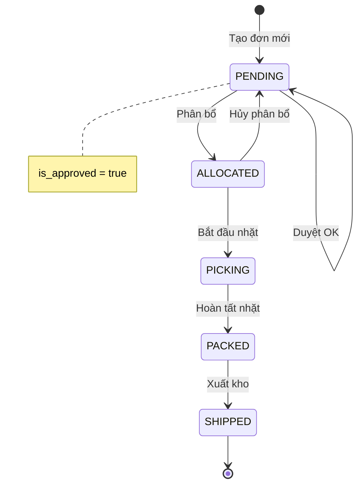
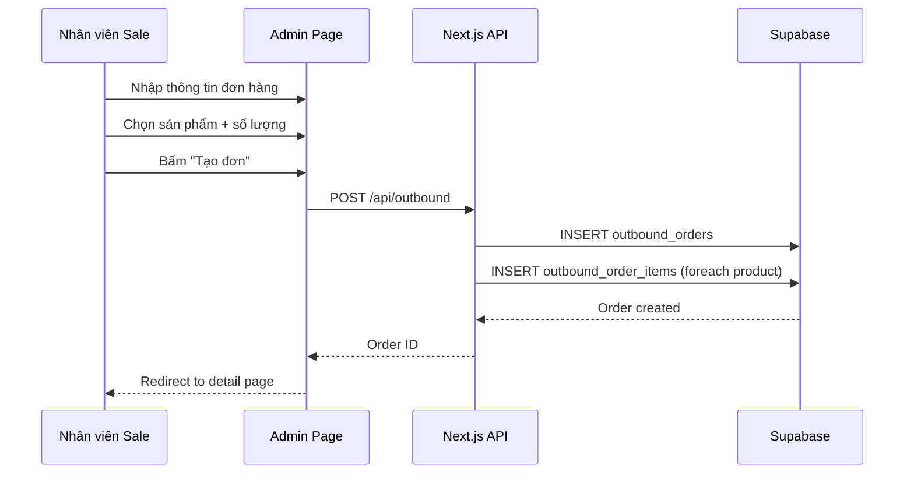
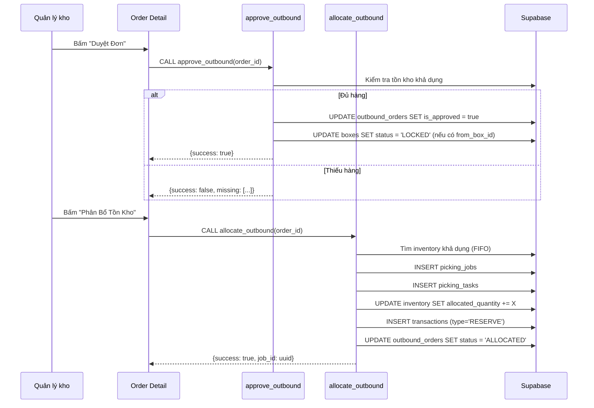

# Module 3: Outbound Orders (Đơn Hàng Xuất)

> **Last Updated:** 2026-02-05  
> **Status:** Active

---

## 1. Overview

Module Outbound Orders quản lý toàn bộ quy trình tạo và xử lý đơn hàng xuất, bao gồm:
- Tạo đơn bán hàng (SALE)
- Tạo đơn điều chuyển (TRANSFER)
- Duyệt đơn hàng
- Phân bổ tồn kho

---

## 2. Features

| Feature | Description | UI Page |
|---------|-------------|---------|
| Tạo đơn mới | Tạo đơn SALE/TRANSFER/GIFT | `/admin/outbound/new` |
| Danh sách đơn | Xem và lọc đơn hàng | `/admin/outbound` |
| Chi tiết đơn | Xem thông tin đầy đủ | `/admin/outbound/[id]` |
| Duyệt đơn | Kiểm tra tồn kho và duyệt | `/admin/outbound/[id]` |
| Phân bổ | Gán tồn kho cho đơn | `/admin/outbound/[id]` |
| Hủy duyệt | Mở khóa tồn kho | `/admin/outbound/[id]` |
| Sửa đơn | Chỉnh sửa đơn chưa duyệt | `/admin/outbound/[id]/edit` |

---

## 3. Order Types

| Type | Code | Description |
|------|------|-------------|
| Bán hàng | `SALE` | Đơn bán cho khách hàng |
| Điều chuyển | `TRANSFER` | Chuyển hàng giữa các kho |
| Tặng | `GIFT` | Đơn hàng tặng |
| Nội bộ | `INTERNAL` | Xuất nội bộ |

---

## 4. Order Status Flow



---

## 5. Data Flow

### 5.1 Luồng Tạo Đơn Hàng



### 5.2 Luồng Duyệt & Phân Bổ



---

## 6. Database Impact

### 6.1 Tables Affected

| Table | Operation | Columns Modified |
|-------|-----------|------------------|
| `outbound_orders` | INSERT/UPDATE | All columns |
| `outbound_order_items` | INSERT/UPDATE | All columns |
| `boxes` | UPDATE | `status`, `outbound_order_id` |
| `inventory_items` | UPDATE (Lẻ) | `allocated_quantity` |
| `bulk_inventory` | UPDATE (Sỉ) | `allocated_quantity` |
| `picking_jobs` | INSERT | All columns |
| `picking_tasks` | INSERT | All columns |
| `transactions` | INSERT | (ghi log RESERVE) |

### 6.2 Column Details

#### `outbound_orders` Table
```sql
id UUID PRIMARY KEY
code TEXT UNIQUE              -- VD: OB-0205-0001
type TEXT                     -- 'SALE' | 'TRANSFER' | 'GIFT' | 'INTERNAL'
transfer_type TEXT            -- 'ITEM' | 'BOX'
inventory_type TEXT           -- 'PIECE' | 'BULK'
status TEXT                   -- 'PENDING' | 'ALLOCATED' | 'PICKING' | 'PACKED' | 'SHIPPED'
is_approved BOOLEAN           -- Đã duyệt chưa
customer_id UUID              -- FK to customers (for SALE)
destination_id UUID           -- FK to destinations (for TRANSFER)
sale_staff_id UUID            -- FK to internal_staff
subtotal DECIMAL              -- Tổng trước CK
discount_type TEXT            -- 'PERCENT' | 'FIXED'
discount_value DECIMAL        -- Giá trị CK
discount_amount DECIMAL       -- Số tiền CK
total DECIMAL                 -- Tổng sau CK
note TEXT
created_at TIMESTAMP
approved_at TIMESTAMP
allocated_at TIMESTAMP
shipped_at TIMESTAMP
```

#### `outbound_order_items` Table
```sql
id UUID PRIMARY KEY
order_id UUID                 -- FK to outbound_orders
product_id UUID               -- FK to products
quantity INTEGER              -- Số lượng đặt
picked_quantity INTEGER       -- Số lượng đã nhặt
unit_price DECIMAL
discount_percent DECIMAL
line_total DECIMAL
from_box_id UUID              -- Thùng chỉ định (optional)
created_at TIMESTAMP
```

---

## 7. RPC Functions

### 7.1 `approve_outbound`

**Purpose:** Kiểm tra tồn kho và duyệt đơn hàng.

**Signature:**
```sql
FUNCTION approve_outbound(p_order_id UUID)
RETURNS JSONB
```

**Logic:**
1. Kiểm tra đơn hàng tồn tại và chưa duyệt
2. Với mỗi item trong đơn:
   - Tính tổng tồn khả dụng (`quantity - allocated_quantity`)
   - So sánh với số lượng đặt
3. Nếu thiếu bất kỳ SP nào → Return lỗi với danh sách thiếu
4. Nếu đủ:
   - Update `is_approved = true`
   - Lock các thùng đã chỉ định (`from_box_id`)
5. Return success

**Database Operations:**
```sql
-- Check availability (for PIECE orders)
SELECT SUM(quantity - COALESCE(allocated_quantity, 0))
FROM inventory_items
WHERE product_id = item.product_id;

-- Check availability (for BULK orders)
SELECT SUM(quantity - COALESCE(allocated_quantity, 0))
FROM bulk_inventory
WHERE product_id = item.product_id;

-- Approve
UPDATE outbound_orders 
SET is_approved = TRUE, approved_at = NOW()
WHERE id = p_order_id;

-- Lock boxes
UPDATE boxes 
SET status = 'LOCKED', outbound_order_id = p_order_id
WHERE id IN (SELECT from_box_id FROM outbound_order_items WHERE order_id = p_order_id);
```

### 7.2 `allocate_outbound`

**Purpose:** Phân bổ tồn kho cụ thể cho đơn hàng, tạo Picking Job.

**Signature:**
```sql
FUNCTION allocate_outbound(p_order_id UUID)
RETURNS JSONB
```

**Logic:**
1. Validate: Đơn đã duyệt chưa? Status có phải PENDING không?
2. Tạo `picking_jobs` mới (type = BOX_PICK hoặc ITEM_PICK)
3. Với mỗi item trong đơn:
   - Tìm inventory records có hàng khả dụng
   - Ưu tiên theo chiến lược (FIFO / MATCH_ORDER_CONTENT)
   - Tạo `picking_tasks`
   - Update `allocated_quantity` trên inventory
   - Log `transactions` (type = 'RESERVE')
4. Lock các thùng được chọn
5. Update status = 'ALLOCATED'

### 7.3 `unapprove_outbound` / `deallocate_outbound`

**Purpose:** Hủy duyệt / Hủy phân bổ để chỉnh sửa đơn.

**Logic:**
1. Kiểm tra đơn có đang ở trạng thái cho phép hủy không
2. Trả lại `allocated_quantity` về inventory
3. Reset trạng thái thùng về 'OPEN'
4. Xóa `picking_jobs` và `picking_tasks`

---

## 8. UI Pages

### 8.1 Admin Pages
| Page | Path | Purpose |
|------|------|---------|
| Order List | `/admin/outbound` | Danh sách đơn hàng |
| Create Order | `/admin/outbound/new` | Tạo đơn mới |
| Order Detail | `/admin/outbound/[id]` | Chi tiết + Actions |
| Edit Order | `/admin/outbound/[id]/edit` | Chỉnh sửa |

---

## 9. Transaction Types

| Type | Description | Triggered By |
|------|-------------|--------------|
| `RESERVE` | Đặt trước tồn kho | `allocate_outbound` |
| `RELEASE` | Giải phóng tồn kho | `deallocate_outbound` |

---

## 10. Known Issues & Notes

### 10.1 Inventory Type Separation
> **CRITICAL:** `inventory_type` trên đơn hàng quyết định nguồn tồn kho:
> - `PIECE` → Chỉ lấy từ `inventory_items`
> - `BULK` → Chỉ lấy từ `bulk_inventory`

### 10.2 Box Locking
Khi duyệt đơn có `from_box_id` được chỉ định, thùng đó sẽ bị LOCK để các đơn khác không thể phân bổ.

### 10.3 Allocation Strategy
Hệ thống sử dụng chiến lược FIFO (First In First Out) mặc định.

---

## 11. Related Modules

- **[02_INVENTORY.md](./02_INVENTORY.md)** - Nguồn tồn kho để phân bổ
- **[04_PICKING_PACKING.md](./04_PICKING_PACKING.md)** - Thực hiện Job nhặt hàng
- **[05_SHIPPING.md](./05_SHIPPING.md)** - Xuất kho sau khi đóng gói
