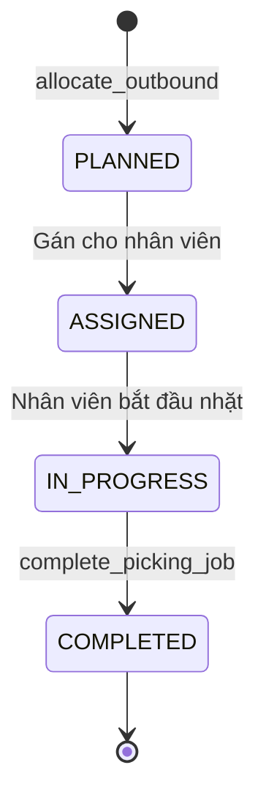
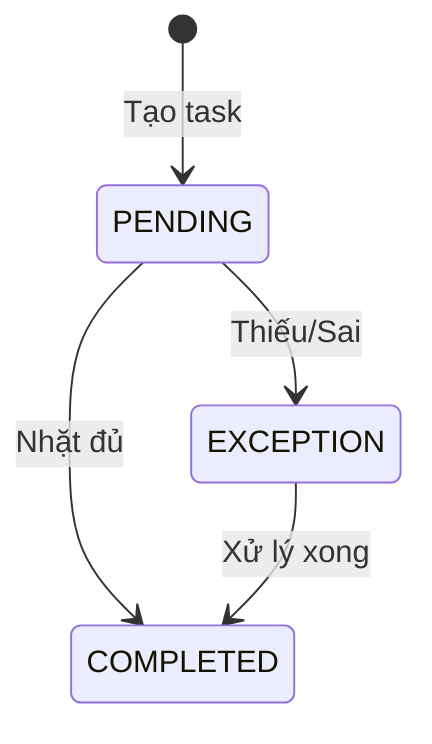
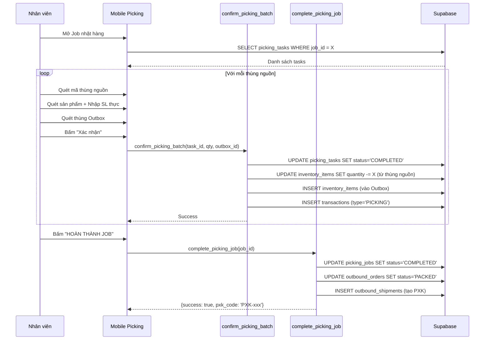
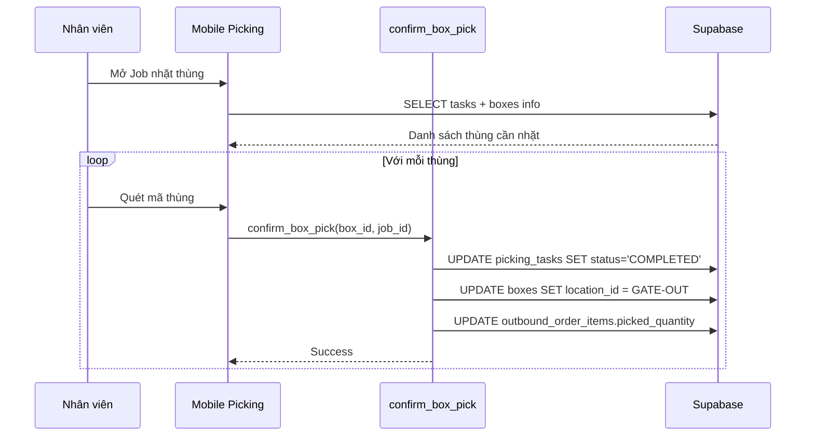
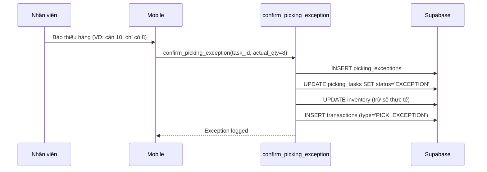

# Module 4: Picking & Packing (Nhặt & Đóng Gói)

> **Last Updated:** 2026-02-05  
> **Status:** Active

---

## 1. Overview

Module Picking & Packing quản lý toàn bộ quy trình nhặt hàng và đóng gói, bao gồm:
- Picking Jobs (Công việc nhặt hàng)
- Picking Tasks (Tác vụ nhặt từng thùng)
- Xử lý ngoại lệ (Exception handling)
- Đóng gói vào Outbox

---

## 2. Job Types

| Type | Description | Luồng |
|------|-------------|-------|
| `ITEM_PICK` | Nhặt hàng lẻ vào Outbox | Lấy từ kệ → Cho vào thùng đóng gói |
| `BOX_PICK` | Nhặt nguyên thùng | Lấy nguyên thùng gốc → Xuất luôn |
| `WAVE_PICK` | Nhặt theo Wave | Nhiều đơn → Sorting desk → Phân loại |

---

## 3. Status Flow

### 3.1 Job Status



### 3.2 Task Status



---

## 4. Data Flow

### 4.1 Luồng Nhặt Hàng Lẻ (Item Pick)



### 4.2 Luồng Nhặt Nguyên Thùng (Box Pick)



### 4.3 Luồng Xử Lý Ngoại Lệ



---

## 5. Database Impact

### 5.1 Tables Affected

| Table | Operation | Columns Modified |
|-------|-----------|------------------|
| `picking_jobs` | INSERT/UPDATE | `status`, `assigned_to`, `completed_at` |
| `picking_tasks` | INSERT/UPDATE | `status`, `picked_at`, `picked_by` |
| `picking_exceptions` | INSERT | All columns |
| `inventory_items` | UPDATE | `quantity`, `allocated_quantity` |
| `bulk_inventory` | UPDATE | `quantity`, `allocated_quantity` |
| `outbound_order_items` | UPDATE | `picked_quantity` |
| `boxes` | UPDATE | `location_id`, `status` |
| `transactions` | INSERT | (log PICKING/PICK_EXCEPTION) |

### 5.2 Column Details

#### `picking_jobs` Table
```sql
id UUID PRIMARY KEY
outbound_order_id UUID       -- FK to outbound_orders
order_id UUID                -- Legacy FK
type TEXT                    -- 'ITEM_PICK' | 'BOX_PICK' | 'WAVE_PICK'
status TEXT                  -- 'PLANNED' | 'ASSIGNED' | 'IN_PROGRESS' | 'COMPLETED'
assigned_to UUID             -- FK to users
outbox_id UUID               -- Thùng đóng gói (for ITEM_PICK)
created_at TIMESTAMP
completed_at TIMESTAMP
```

#### `picking_tasks` Table
```sql
id UUID PRIMARY KEY
job_id UUID                  -- FK to picking_jobs
order_item_id UUID           -- FK to outbound_order_items
product_id UUID              -- FK to products
box_id UUID                  -- Thùng nguồn (lấy hàng từ đây)
location_id UUID             -- Vị trí thùng nguồn
quantity INTEGER             -- Số lượng cần nhặt
status TEXT                  -- 'PENDING' | 'COMPLETED' | 'EXCEPTION'
picked_at TIMESTAMP
picked_by UUID
```

#### `picking_exceptions` Table
```sql
id UUID PRIMARY KEY
task_id UUID                 -- FK to picking_tasks
job_id UUID                  -- FK to picking_jobs
product_id UUID
expected_quantity INTEGER    -- SL yêu cầu
actual_quantity INTEGER      -- SL thực tế
reason TEXT                  -- Lý do thiếu
resolved BOOLEAN DEFAULT FALSE
resolved_at TIMESTAMP
resolved_by UUID
created_at TIMESTAMP
created_by UUID
```

---

## 6. RPC Functions

### 6.1 `confirm_picking_batch`

**Purpose:** Xác nhận nhặt hàng lẻ, trừ kho nguồn và nhập vào Outbox.

**Signature:**
```sql
FUNCTION confirm_picking_batch(
    p_task_id UUID,
    p_actual_quantity INTEGER,
    p_outbox_id UUID,
    p_user_id UUID
) RETURNS JSONB
```

**Logic:**
1. Lấy thông tin task (product, source_box, expected_qty)
2. Trừ `inventory_items.quantity` tại thùng nguồn
3. Trừ `inventory_items.allocated_quantity`
4. Cộng vào `inventory_items` tại Outbox
5. Log transaction (type='PICKING')
6. Update task status = 'COMPLETED'

### 6.2 `confirm_box_pick`

**Purpose:** Xác nhận nhặt nguyên thùng cho BOX_PICK job.

**Signature:**
```sql
FUNCTION confirm_box_pick(
    p_box_id UUID,
    p_job_id UUID,
    p_user_id UUID
) RETURNS JSONB
```

**Logic:**
1. Tìm các tasks của job này liên quan đến box
2. Update tasks status = 'COMPLETED'
3. Update box location = GATE-OUT
4. Update outbound_order_items.picked_quantity

### 6.3 `complete_picking_job`

**Purpose:** Hoàn tất Job nhặt hàng, cập nhật trạng thái đơn và tạo PXK.

**Signature:**
```sql
FUNCTION complete_picking_job(
    p_job_id UUID,
    p_user_id UUID
) RETURNS JSONB
```

**Logic:**
1. Kiểm tra tất cả tasks đã COMPLETED
2. Update job status = 'COMPLETED'
3. Tìm đơn hàng liên quan
4. Kiểm tra các jobs khác của đơn (nếu có)
5. Nếu tất cả jobs xong:
   - Update order status = 'PACKED'
   - Tạo outbound_shipments (PXK)
6. Di chuyển Outbox → GATE-OUT

### 6.4 `confirm_picking_exception`

**Purpose:** Ghi nhận ngoại lệ khi số lượng thực tế khác với yêu cầu.

---

## 7. UI Pages

### 7.1 Admin Pages
| Page | Path | Purpose |
|------|------|---------|
| Picking Jobs | `/admin/picking-jobs` | Quản lý công việc nhặt hàng |
| Exceptions | `/admin/exceptions` | Xem ngoại lệ |
| Sorting | `/admin/sorting` | Phân loại Wave |

### 7.2 Mobile Pages
| Page | Path | Purpose |
|------|------|---------|
| Picking | `/mobile/picking/[id]` | Thực hiện nhặt hàng |
| Consolidate | `/mobile/consolidate` | Gom hàng Wave |

---

## 8. Transaction Types

| Type | Description | Triggered By |
|------|-------------|--------------|
| `PICKING` | Nhặt hàng thành công | `confirm_picking_batch` |
| `PICK_EXCEPTION` | Nhặt có ngoại lệ | `confirm_picking_exception` |
| `SWAP_PICK` | Đổi thùng nguồn | `swap_and_pick` |

---

## 9. Known Issues & Notes

### 9.1 Polymorphic Inventory
> **CRITICAL:** Hàm `confirm_picking_batch` phải kiểm tra loại thùng:
> - Thùng `BULK` → Trừ từ `bulk_inventory`
> - Thùng `STORAGE` → Trừ từ `inventory_items`

### 9.2 Box Count Calculation
Khi tính số lượng thùng xuất:
- **ITEM_PICK:** Đếm các Outbox (thùng đóng gói)
- **BOX_PICK:** Đếm các thùng gốc được nhặt

### 9.3 WAVE_PICK Special Handling
Đơn qua Wave cần đợi phân loại tại Sorting Desk trước khi chuyển sang PACKED.

---

## 10. Related Modules

- **[03_OUTBOUND_ORDERS.md](./03_OUTBOUND_ORDERS.md)** - Nguồn Job từ Allocation
- **[05_SHIPPING.md](./05_SHIPPING.md)** - Xuất kho sau Packed
- **[06_WAVE_MANAGEMENT.md](./06_WAVE_MANAGEMENT.md)** - Quản lý Wave
