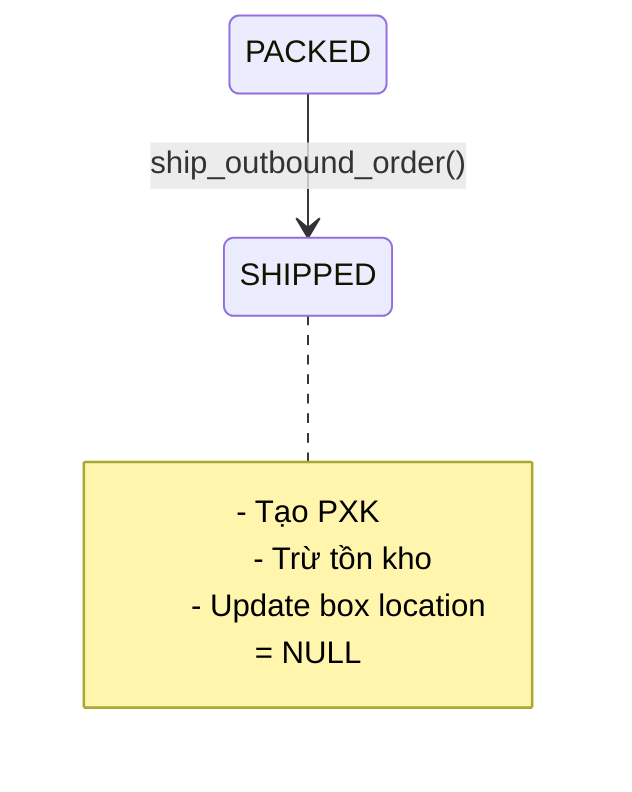
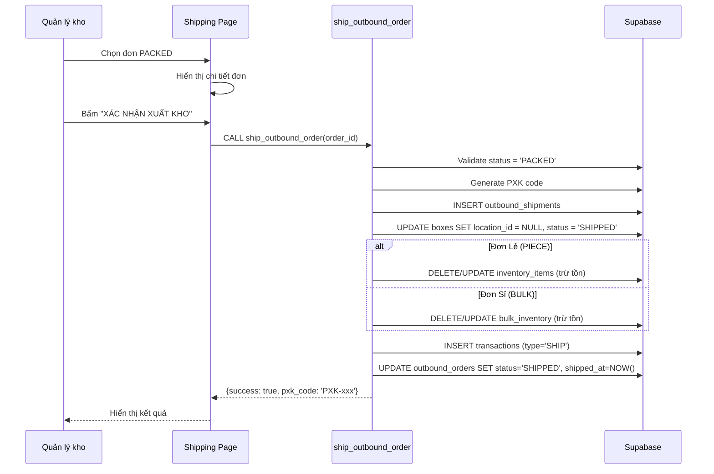

# Module 5: Shipping (Xuất Kho)

> **Last Updated:** 2026-02-05  
> **Status:** Active

---

## 1. Overview

Module Shipping quản lý quy trình xuất kho cuối cùng, bao gồm:
- Xem danh sách đơn đã đóng gói
- Xác nhận xuất kho
- Tạo Phiếu Xuất Kho (PXK)
- Ghi nhận giao dịch xuất

---

## 2. Features

| Feature | Description | UI Page |
|---------|-------------|---------|
| Danh sách chờ xuất | Xem đơn PACKED chờ xuất | `/admin/shipping` |
| Chi tiết xuất | Xem thông tin trước khi xuất | `/admin/shipping/[id]` |
| Xác nhận xuất kho | Thực hiện xuất và tạo PXK | `/admin/shipping/[id]` |
| Lịch sử xuất | Xem đơn đã SHIPPED | `/admin/shipping` |

---

## 3. Status Flow



---

## 4. Data Flow

### 4.1 Luồng Xuất Kho



---

## 5. Database Impact

### 5.1 Tables Affected

| Table | Operation | Columns Modified |
|-------|-----------|------------------|
| `outbound_orders` | UPDATE | `status='SHIPPED'`, `shipped_at` |
| `outbound_shipments` | INSERT | All columns |
| `boxes` | UPDATE | `location_id=NULL`, `status='SHIPPED'` |
| `inventory_items` | DELETE/UPDATE | `quantity`, `allocated_quantity` |
| `bulk_inventory` | DELETE/UPDATE | `quantity`, `allocated_quantity` |
| `transactions` | INSERT | (log SHIP transaction) |

### 5.2 Column Details

#### `outbound_shipments` Table
```sql
id UUID PRIMARY KEY
code TEXT UNIQUE              -- VD: PXK-0205-0001
source_type TEXT              -- 'ORDER' | 'TRANSFER' | 'MANUAL_JOB'
source_id UUID                -- FK to outbound_orders
outbound_order_id UUID        -- FK to outbound_orders
item_count INTEGER            -- Tổng số lượng sản phẩm
box_count INTEGER             -- Số lượng thùng xuất
box_ids UUID[]                -- Array các box_id đã xuất
created_by UUID               -- FK to users
created_at TIMESTAMP
metadata JSONB                -- Thông tin bổ sung
```

---

## 6. RPC Functions

### 6.1 `ship_outbound_order`

**Purpose:** Xác nhận xuất kho, tạo PXK, trừ tồn kho.

**Signature:**
```sql
FUNCTION ship_outbound_order(p_order_id UUID)
RETURNS JSONB
```

**Input:** `p_order_id` - UUID của đơn hàng

**Output:**
```json
{
  "success": true,
  "shipment_id": "uuid",
  "pxk_code": "PXK-0205-0001",
  "box_count": 5,
  "item_count": 120
}
```

**Logic Flow:**
1. **Validate:** Kiểm tra đơn có status = 'PACKED' không
2. **Calculate:**
   - Đếm số lượng thùng (`box_count`)
   - Tính tổng số lượng sản phẩm (`item_count`)
3. **Generate PXK:** Tạo mã PXK mới bằng `generate_pxk_code()`
4. **Create Shipment:** INSERT vào `outbound_shipments`
5. **Update Boxes:**
   - Set `location_id = NULL`
   - Set `status = 'SHIPPED'`
6. **Clear Inventory:**
   - Với PIECE: DELETE từ `inventory_items`
   - Với BULK: DELETE từ `bulk_inventory`
7. **Log Transaction:** INSERT vào `transactions`
8. **Update Order:** SET `status = 'SHIPPED'`, `shipped_at = NOW()`

### 6.2 `generate_pxk_code`

**Purpose:** Tạo mã PXK theo format `PXK-MMDD-XXXX`

---

## 7. Box Count Calculation

> **CRITICAL:** Logic đếm thùng phải phân biệt loại nhặt hàng.

### 7.1 Item Pick (Đơn Lẻ)
```sql
-- Đếm các Outbox (thùng đóng gói)
SELECT COUNT(*) FROM boxes 
WHERE outbound_order_id = p_order_id 
AND type = 'OUTBOX';
```

### 7.2 Box Pick (Đơn Sỉ)
```sql
-- Đếm các thùng gốc được nhặt
SELECT COUNT(DISTINCT pt.box_id) 
FROM picking_tasks pt
JOIN picking_jobs pj ON pt.job_id = pj.id
WHERE pj.outbound_order_id = p_order_id
AND pj.type = 'BOX_PICK';
```

---

## 8. UI Pages

| Page | Path | Purpose |
|------|------|---------|
| Shipping List | `/admin/shipping` | Danh sách đơn chờ xuất/đã xuất |
| Shipping Detail | `/admin/shipping/[id]` | Chi tiết và xác nhận xuất |

---

## 9. Transaction Types

| Type | Description | Triggered By |
|------|-------------|--------------|
| `SHIP` | Xuất kho thành công | `ship_outbound_order` |
| `EXPORT` | Legacy - Xuất hàng | (Old system) |

---

## 10. Known Issues & Notes

### 10.1 Inventory Type Handling
> **BUG ALERT:** Hiện tại hàm `ship_outbound_order` có thể chỉ đang xóa từ `inventory_items`, chưa xử lý đúng cho đơn `BULK`.

**Expected Behavior:**
- Đơn `inventory_type = 'PIECE'` → Trừ từ `inventory_items`
- Đơn `inventory_type = 'BULK'` → Trừ từ `bulk_inventory`

### 10.2 Box Count Mismatch
Frontend đang đếm thùng bằng cách gom cả:
- `boxes.outbound_order_id`
- `picking_tasks.box_id`

Điều này **SAI** vì `picking_tasks.box_id` là thùng nguồn (lấy hàng), không phải thùng xuất.

### 10.3 Solution Recommendation
```sql
-- Đúng: Chỉ đếm Outbox cho ITEM_PICK
SELECT COUNT(*) FROM boxes 
WHERE outbound_order_id = p_order_id 
AND type IN ('OUTBOX');

-- Hoặc sử dụng box_count đã snapshot trong outbound_shipments
```

---

## 11. Related Modules

- **[04_PICKING_PACKING.md](./04_PICKING_PACKING.md)** - Nguồn đơn PACKED
- **[07_TRANSACTIONS.md](./07_TRANSACTIONS.md)** - Log giao dịch SHIP
