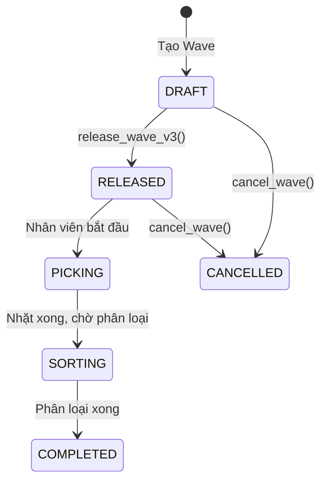
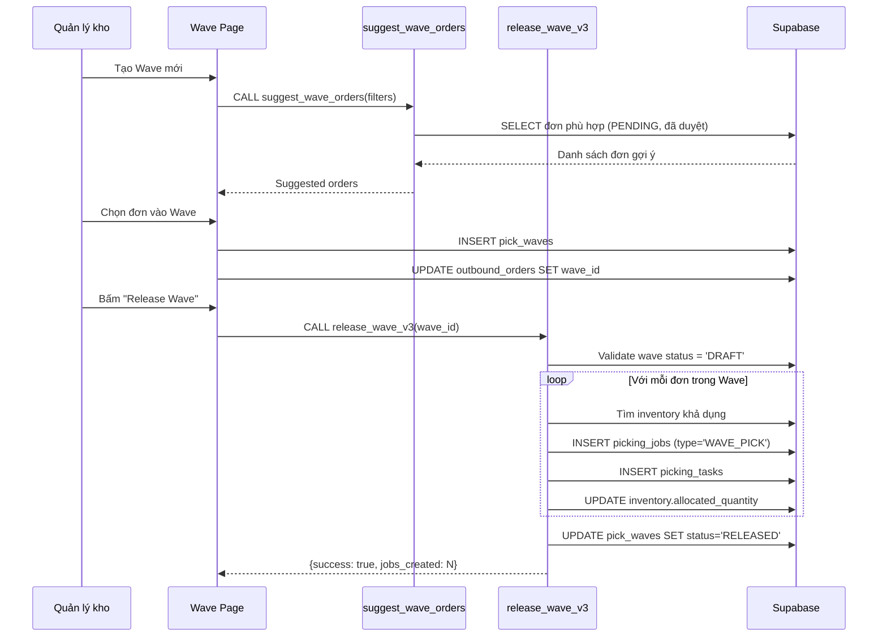
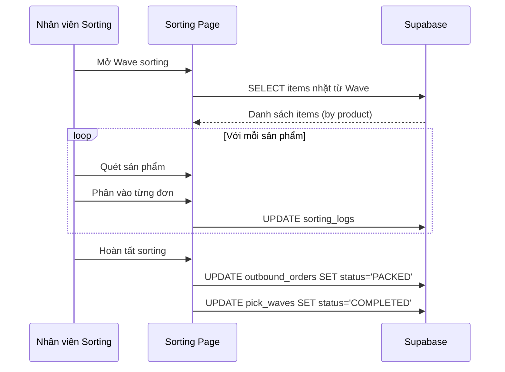
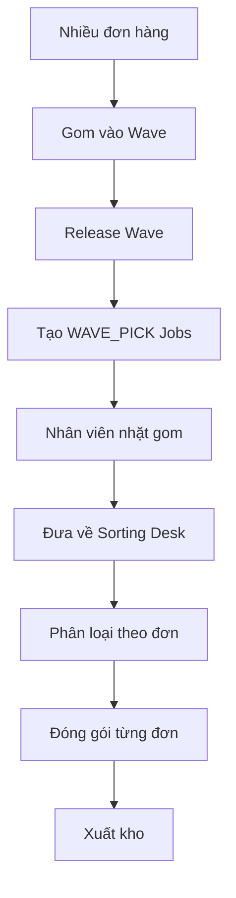

# Module 6: Wave Management (Quản Lý Wave)

> **Last Updated:** 2026-02-05  
> **Status:** Active

---

## 1. Overview

Module Wave Management quản lý việc gom nhóm nhiều đơn hàng để nhặt cùng lúc, tối ưu hóa quá trình picking.

---

## 2. Features

| Feature | Description | UI Page |
|---------|-------------|---------|
| Tạo Wave mới | Tạo đợt nhặt hàng | `/admin/waves/new` |
| Danh sách Wave | Xem các Wave | `/admin/waves` |
| Chi tiết Wave | Xem đơn trong Wave | `/admin/waves/[id]` |
| Release Wave | Phát hành Wave để nhặt | `/admin/waves/[id]` |
| Cancel Wave | Hủy Wave | `/admin/waves/[id]` |
| Gợi ý đơn hàng | AI suggest đơn phù hợp | `/admin/waves/new` |

---

## 3. Wave Status Flow



---

## 4. Data Flow

### 4.1 Luồng Tạo và Release Wave



### 4.2 Luồng Sorting (Phân Loại)



---

## 5. Database Impact

### 5.1 Tables Affected

| Table | Operation | Columns Modified |
|-------|-----------|------------------|
| `pick_waves` | INSERT/UPDATE | All columns |
| `outbound_orders` | UPDATE | `wave_id`, `status` |
| `picking_jobs` | INSERT | (type='WAVE_PICK') |
| `picking_tasks` | INSERT | All columns |
| `inventory_items` | UPDATE | `allocated_quantity` |
| `bulk_inventory` | UPDATE | `allocated_quantity` |
| `sorting_logs` | INSERT | All columns |

### 5.2 Column Details

#### `pick_waves` Table
```sql
id UUID PRIMARY KEY
name TEXT                     -- Tên Wave
code TEXT UNIQUE              -- Mã Wave
status TEXT                   -- 'DRAFT' | 'RELEASED' | 'PICKING' | 'SORTING' | 'COMPLETED' | 'CANCELLED'
created_by UUID               -- FK to users
assigned_to UUID              -- Nhân viên phụ trách
zone TEXT                     -- Khu vực nhặt
created_at TIMESTAMP
released_at TIMESTAMP
completed_at TIMESTAMP
```

---

## 6. RPC Functions

### 6.1 `suggest_wave_orders`

**Purpose:** Gợi ý đơn hàng phù hợp để thêm vào Wave.

**Logic:**
1. Lọc đơn có status = 'PENDING' và is_approved = true
2. Sắp xếp theo độ ưu tiên, ngày tạo
3. Có thể lọc theo zone, khách hàng, loại đơn

### 6.2 `release_wave_v3`

**Purpose:** Phát hành Wave, tạo Picking Jobs và phân bổ tồn kho.

**Signature:**
```sql
FUNCTION release_wave_v3(p_wave_id UUID, p_user_id UUID)
RETURNS JSONB
```

**Logic:**
1. Validate Wave tồn tại và status = 'DRAFT'
2. Với mỗi đơn trong Wave:
   - Tạo picking_jobs (type='WAVE_PICK')
   - Với mỗi item trong đơn:
     - Tìm inventory khả dụng
     - Tạo picking_tasks
     - Update allocated_quantity
3. Update Wave status = 'RELEASED'

### 6.3 `cancel_wave`

**Purpose:** Hủy Wave, giải phóng tồn kho đã cấp phát.

**Logic:**
1. Kiểm tra Wave có thể hủy không (chưa bắt đầu nhặt)
2. Với mỗi đơn trong Wave:
   - Giảm allocated_quantity
   - Xóa picking_tasks, picking_jobs
   - Reset order về trạng thái trước
3. Update Wave status = 'CANCELLED'

---

## 7. Wave Picking Flow



---

## 8. UI Pages

| Page | Path | Purpose |
|------|------|---------|
| Wave List | `/admin/waves` | Danh sách Wave |
| Create Wave | `/admin/waves/new` | Tạo Wave mới |
| Wave Detail | `/admin/waves/[id]` | Chi tiết + Actions |
| Sorting | `/admin/sorting` | Danh sách wave cần sorting |
| Sorting Run | `/admin/sorting/[id]/run` | Thực hiện phân loại |

---

## 9. Known Issues & Notes

### 9.1 WAVE_PICK Special Status
Đơn qua Wave không tự động chuyển sang PACKED khi hoàn tất picking. Cần:
1. Nhặt hàng → Job COMPLETED
2. Phân loại tại Sorting Desk
3. Nhân viên xác nhận từng đơn → PACKED

### 9.2 Inventory Allocation
Wave allocation gộp tất cả items của các đơn, sau đó phân bổ một lần để tối ưu.

---

## 10. Related Modules

- **[03_OUTBOUND_ORDERS.md](./03_OUTBOUND_ORDERS.md)** - Nguồn đơn vào Wave
- **[04_PICKING_PACKING.md](./04_PICKING_PACKING.md)** - Thực hiện picking
