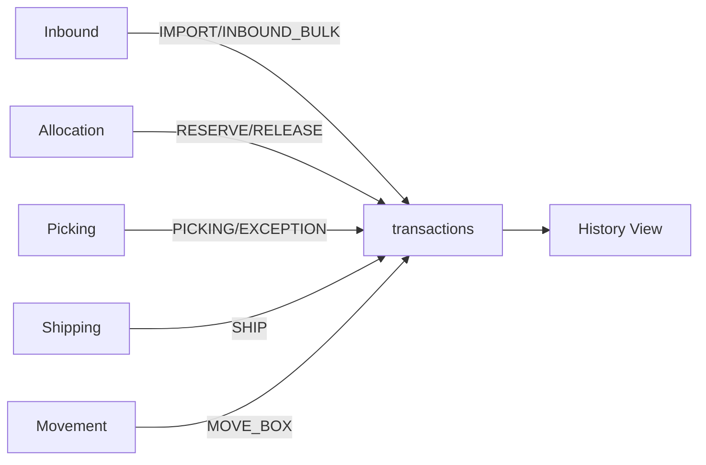

# Module 7: Transactions & History (Lịch Sử Giao Dịch)

> **Last Updated:** 2026-02-05  
> **Status:** Active

---

## 1. Overview

Module Transactions ghi nhận tất cả hoạt động thay đổi tồn kho trong hệ thống.

---

## 2. Transaction Types

| Type | Description | Trigger |
|------|-------------|---------|
| `IMPORT` | Nhập hàng lẻ | `/mobile/import` |
| `INBOUND_BULK` | Nhập hàng sỉ | `process_bulk_putaway` |
| `RESERVE` | Đặt trước tồn kho | `allocate_outbound` |
| `RELEASE` | Giải phóng tồn kho | `deallocate_outbound` |
| `PICKING` | Nhặt hàng | `confirm_picking_batch` |
| `PICK_EXCEPTION` | Ngoại lệ nhặt | `confirm_picking_exception` |
| `SWAP_PICK` | Đổi thùng nguồn | `swap_and_pick` |
| `SHIP` | Xuất kho | `ship_outbound_order` |
| `MOVE_BOX` | Di chuyển thùng | Mobile transfer |
| `ADJUST` | Điều chỉnh tồn | Manual audit |

---

## 3. Data Flow



---

## 4. Database Schema

### `transactions` Table
```sql
id UUID PRIMARY KEY
type TEXT                     -- Transaction type (see above)
entity_type TEXT              -- 'ITEM' | 'BOX' | 'ORDER'
sku TEXT                      -- Product SKU
quantity INTEGER              -- Số lượng thay đổi (+/-)
from_box_id UUID              -- Thùng nguồn
to_box_id UUID                -- Thùng đích
from_location_id UUID         -- Vị trí nguồn
to_location_id UUID           -- Vị trí đích
reference_id UUID             -- ID đối tượng liên quan
reference_type TEXT           -- 'ORDER' | 'JOB' | 'WAVE'
user_id UUID                  -- Người thực hiện
note TEXT                     -- Ghi chú
created_at TIMESTAMP

-- Constraint for valid types
CHECK (type IN (
    'IMPORT', 'EXPORT', 'SHIP', 'SELL', 
    'TRANSFER_IN', 'TRANSFER_OUT', 
    'MOVE', 'MOVE_BOX', 'PICK_MOVE', 
    'PACK', 'ADJUST', 'AUDIT', 
    'INBOUND_BULK', 'RESERVE', 'RELEASE',
    'MISCELLANEOUS_ISSUE', 'MISCELLANEOUS_RECEIPT',
    'EXPORT_SALE', 'EXPORT_GIFT',
    'PICKING', 'PICK_EXCEPTION', 'SWAP_PICK'
))
```

---

## 5. UI Pages

| Page | Path | Purpose |
|------|------|---------|
| History | `/admin/history` | Xem lịch sử giao dịch |

---

## 6. Query Examples

### Lịch sử theo sản phẩm
```sql
SELECT * FROM transactions
WHERE sku = 'ABC-123'
ORDER BY created_at DESC;
```

### Lịch sử theo thùng
```sql
SELECT * FROM transactions
WHERE from_box_id = 'uuid' OR to_box_id = 'uuid'
ORDER BY created_at DESC;
```

---

## 7. Related Modules
- All modules create transactions for audit trail
