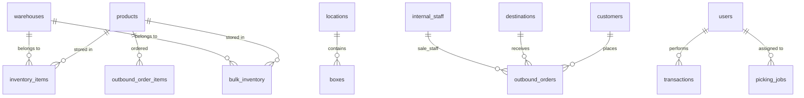

# Module 8: Master Data (Dữ Liệu Chủ)

> **Last Updated:** 2026-02-05  
> **Status:** Active

---

## 1. Overview

Module Master Data quản lý các dữ liệu nền tảng của hệ thống.

---

## 2. Entities

### 2.1 Products (Sản phẩm)
| Column | Type | Description |
|--------|------|-------------|
| `id` | UUID | Primary key |
| `sku` | TEXT | Mã sản phẩm (unique) |
| `barcode` | TEXT | Mã vạch |
| `name` | TEXT | Tên sản phẩm |
| `category` | TEXT | Phân loại |
| `unit` | TEXT | Đơn vị tính |
| `price` | DECIMAL | Giá bán |
| `cost` | DECIMAL | Giá vốn |

**UI:** `/admin/products`, `/admin/products/import`

---

### 2.2 Locations (Vị trí kho)
| Column | Type | Description |
|--------|------|-------------|
| `id` | UUID | Primary key |
| `code` | TEXT | Mã vị trí (unique) |
| `zone` | TEXT | Khu vực (A, B, C...) |
| `row` | TEXT | Dãy |
| `column` | TEXT | Cột |
| `level` | TEXT | Tầng |
| `type` | TEXT | 'STORAGE' / 'GATE-IN' / 'GATE-OUT' |
| `is_restricted` | BOOLEAN | Vùng hạn chế |

**UI:** `/admin/locations`

---

### 2.3 Customers (Khách hàng)
| Column | Type | Description |
|--------|------|-------------|
| `id` | UUID | Primary key |
| `code` | TEXT | Mã KH |
| `name` | TEXT | Tên KH |
| `phone` | TEXT | SĐT |
| `address` | TEXT | Địa chỉ |
| `default_discount` | DECIMAL | CK mặc định |

**UI:** `/admin/customers`

---

### 2.4 Destinations (Điểm đến)
| Column | Type | Description |
|--------|------|-------------|
| `id` | UUID | Primary key |
| `code` | TEXT | Mã điểm |
| `name` | TEXT | Tên điểm |
| `type` | TEXT | 'STORE' / 'WAREHOUSE' |
| `address` | TEXT | Địa chỉ |

**UI:** `/admin/destinations`

---

### 2.5 Users (Người dùng)
| Column | Type | Description |
|--------|------|-------------|
| `id` | UUID | Primary key |
| `email` | TEXT | Email |
| `name` | TEXT | Họ tên |
| `role` | TEXT | Vai trò |

**UI:** `/admin/users`, `/admin/roles`

---

### 2.6 Internal Staff (Nhân viên nội bộ)
| Column | Type | Description |
|--------|------|-------------|
| `id` | UUID | Primary key |
| `code` | TEXT | Mã NV |
| `name` | TEXT | Họ tên |
| `department` | TEXT | Bộ phận |

---

### 2.7 Warehouses (Kho ảo)
| Column | Type | Description |
|--------|------|-------------|
| `id` | UUID | Primary key |
| `code` | TEXT | Mã kho |
| `name` | TEXT | Tên kho |
| `type` | TEXT | 'PIECE' / 'BULK' |

---

## 3. Entity Relationship

---

## 4. UI Pages

| Page | Path | Purpose |
|------|------|---------|
| Products | `/admin/products` | Quản lý sản phẩm |
| Import Products | `/admin/products/import` | Import từ Excel |
| Locations | `/admin/locations` | Quản lý vị trí |
| Customers | `/admin/customers` | Quản lý khách hàng |
| Destinations | `/admin/destinations` | Quản lý điểm đến |
| Users | `/admin/users` | Quản lý người dùng |
| Roles | `/admin/roles` | Quản lý phân quyền |
| Partners | `/admin/partners` | Đối tác vận chuyển |
